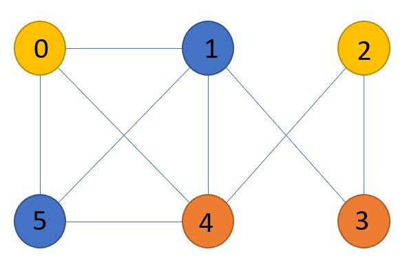

# Python - Greedy Coloring Graph

## This program colors each vertex making sure no neighborning vertex is colored the same.

  
 ### STEP 1.
* Setup working environment, Header Notes/README.
I used Visual Studio Code and Python as my working environnment for this project. I then created a README file in my github account to display
and showcase my steps during the project. 

### STEP 2.
* A buildGraph method was implemented to match the design in the picture from the assignment 
  Vertices from 1 to 6 were added and each of the edges connecting the vertices as well.

### STEP 3.
* An array of four colors was implemented for this specific graph, but more colors will be needed if the graph were to increase in size and more edges are added

### STEP 4.
* An algorithm named colorGraph was created to make sure that no two adjacent nodes or vertices were colored identical. 
The algorighm will ignore the Vertex if the color is the same to it's neigbor and color it differently.

### STEP 5. 
* The number of Vertices needs to be defined in a variable and the edges were defined as well  before running the colorGraph function on the graph

### Result
* The result would be a graph with colored vertices where no neighbor matches the node next to it.
* Vertex 0 color =  Yellow
* Vertex 1 color =  Blue  
* Vertex 2 color =  Yellow
* Vertex 3 color =  Red
* Vertex 4 color =  Red
* Vertex 5 color =  Blue

